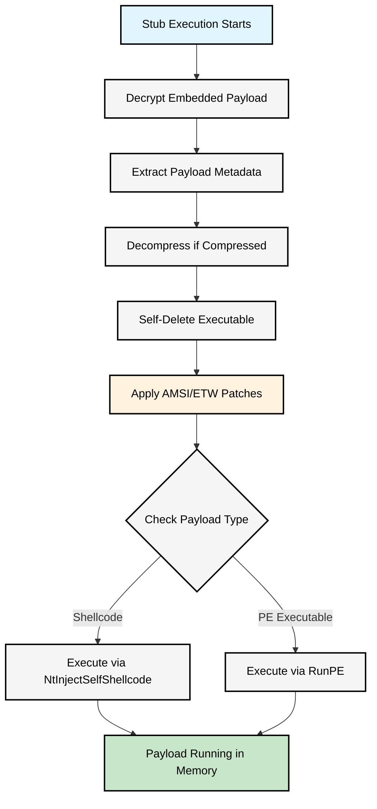

# go-crypter

A cryptographic payload loader and executor designed for advanced in-memory execution techniques. This project combines strong encryption, compression, and sophisticated evasion capabilities to execute both shellcode and PE files directly in memory.

## Features

### Encryption & Compression
- **Multiple encryption algorithms**: ChaCha20-Poly1305, AES-GCM, Twofish-GCM
- **Argon2id key derivation** with configurable parameters for enhanced security
- **Automatic compression** using zlib to reduce payload size
- **CBOR serialization** for efficient binary encoding

### Execution Capabilities
- **Dual payload support**: Handles both raw shellcode and PE executables
- **In-memory PE execution**: Full RunPE implementation with proper relocation and import resolution
- **Shellcode injection**: Direct shellcode execution using advanced injection techniques

### Evasion Features
- **Self-deletion**: Automatic removal of the stub executable from disk
- **Anti-monitoring patches**: Disables AMSI, ETW, debugging, and trace logging
- **Direct syscalls**: Utilizes [go-direct-syscall](https://github.com/carved4/go-direct-syscall) for API evasion
- **Memory-only execution**: No disk artifacts after initial execution

## Usage

### Encrypting Payloads

```bash
# Encrypt shellcode (default)
./crypt -type shellcode payload.bin

# Encrypt PE executable
./crypt -type exe malware.exe

# Specify encryption algorithm
./crypt -alg chacha20 -type exe payload.exe
```

### Available Options
- `-alg`: Encryption algorithm (chacha20, aesgcm, twofish)
- `-type`: Payload type (shellcode, exe)

## Architecture

The project consists of two main components:

1. **Crypt**: Encrypts and packages payloads into CBOR format with embedded metadata
2. **Stub**: Self-contained executable that decrypts and executes the embedded payload

## Execution Flow



## Technical Details

### Cryptographic Implementation
- **Key derivation**: Argon2id with configurable time, memory, and thread parameters
- **Authentication**: All algorithms provide authenticated encryption (AEAD)
- **Random generation**: Cryptographically secure random passwords, salts, and nonces

### Anti-Detection Mechanisms
- **PatchAMSI**: Disable Anti-Malware Scan Interface
- **PatchETW**: Disable Event Tracing for Windows  
- **PatchDbgUiRemoteBreakin**: Prevent remote debugger attachment
- **PatchNtTraceEvent**: Prevent trace event logging
- **PatchNtSystemDebugControl**: Prevent debug control operations

### Memory Execution
- **Section mapping**: Uses NtCreateSection and NtMapViewOfSection for memory allocation
- **Import resolution**: Dynamically resolves imported functions
- **Relocation handling**: Properly handles address relocations for ASLR
- **TLS callbacks**: Executes Thread Local Storage initialization routines

## Dependencies

- `github.com/carved4/go-direct-syscall` - Direct Windows syscall interface
- `github.com/Binject/debug` - PE file parsing and manipulation
- `github.com/fxamacker/cbor/v2` - CBOR encoding/decoding
- `golang.org/x/crypto` - Cryptographic algorithms

## Building

```bash
# Build the encryption tool
go build -o crypt.exe ./crypt

# Build the stub (after encrypting a payload)
go build -o stub.exe ./stub
```

## Security Considerations

This tool is designed for security research, penetration testing, and red team exercises. Users are responsible for ensuring compliance with applicable laws and regulations in their jurisdiction. 